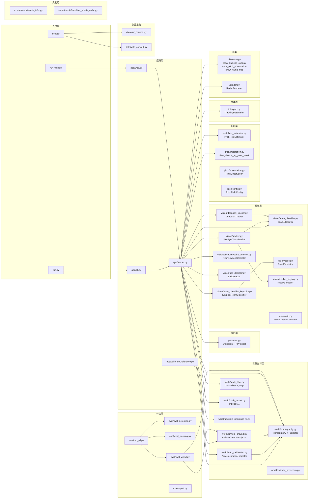

# football-log 架构流程图

## 主流水线

```mermaid
graph TD
    subgraph 入口
        A[run.py] -->|调用| B[app/cli.py main]
        C[run_web.py] -->|import| D[app/web.py demo]
    end

    B -->|构建| E[VideoTrackerPipeline]
    D -->|构建| E

    subgraph runner.py — VideoTrackerPipeline
        E --> F{组件初始化}
        F -->|默认| G[YoloByteTrackTracker]
        F -->|--tracker deepsort| H[DeepSortTracker]
        F -->|--team-class-model| I[6-class YOLO]
        F -->|默认| J[TeamClassifier HSV]
        F -->|--team-classifier keypoint| K[KeypointTeamClassifier]
        F -->|默认| L[TrackingDataWriter]
        F -->|--homography| M[HomographyProjector]
        F -->|--camera-calib| N[PinholeGroundProjector]
        F -->|--auto-calibration-keyframes| O[AutoCalibrationProjector]
        F -->|--bev-smoothing| P[TrackFilter + jump_likelihood]
        F -->|--pitch-field-detect| Q[PitchFieldEstimator]
        F -->|--pitch-keypoint-model| R[PitchKeypointDetector]
        F -->|--ball-model| S[BallDetector]
        F -->|--save-radar| T[RadarRenderer]
    end

    subgraph _iter_frames 每帧循环
        U[读取帧] --> V{应检测?}
        V -->|是| W[detector.detect]
        W --> X[team_classifier 分队]
        V -->|否| Y[复用上次检测]
        X --> Z{有 projector?}
        Y --> Z
        Z -->|是| AA[projector.project → world_x/y]
        Z -->|否| AB{有 _kp_H?}
        AB -->|是| AC[perspectiveTransform → world_x/y]
        AA --> AD{pitch_field_detect?}
        AC --> AD
        AD -->|是| AE[PitchFieldEstimator.estimate]
        AE --> AF[filter_objects_in_grass_mask]
        AD --> AG{有 _pitch_kp_detector?}
        AG -->|是| AH[PitchKeypointDetector.detect → _kp_H EMA]
        AI{有 _ball_detector?} -->|是| AJ[BallDetector.detect → 覆盖球检测]
        AK{有 _track_filter?} -->|是| AL[jump_likelihood_from_height_change + Kalman 平滑]
        AM[TrackingDataWriter.write_frame]
        AN{save_debug_overlay?} -->|是| AO[draw_pitch_observation<br/>草地掩膜 + 场线 + 四边形]
        AN --> AP[draw_tracking_overlay + draw_frame_hud]
        AQ{save_radar?} -->|是| AR[RadarRenderer.render]
    end
```

## 子包依赖关系



## 独立工具（不被主流水线调用）

| 模块 | 功能 | 用途 |
|------|------|------|
| `vision/reid.py` | `ReIDExtractor` Protocol + `cosine_similarity` | #12 Re-ID 扩展预留接口 |
| `world/heuristic_reference_fit.py` | 启发式标定物拟合 | `calibrate_reference.py` 独立标定工具 |
| `world/validate_projection.py` | 投影质量验证（重投影/物理约束/已知点） | 独立 CLI 验证工具 |
| `app/calibrate_reference.py` | 交互式/文件式标定物拟合 | 独立 CLI 标定工具 |
| `eval/` | 检测/跟踪/世界坐标评估 + 报告生成 | 独立评估脚本（subprocess 调用） |
| `data/` | SoccerNet → YOLO 格式转换 | `scripts/prepare_yolo_dataset.py` |
| `experiments/` | TVCalib / Roboflow Sports 环境搭建 | 外部工具集成脚本 |
